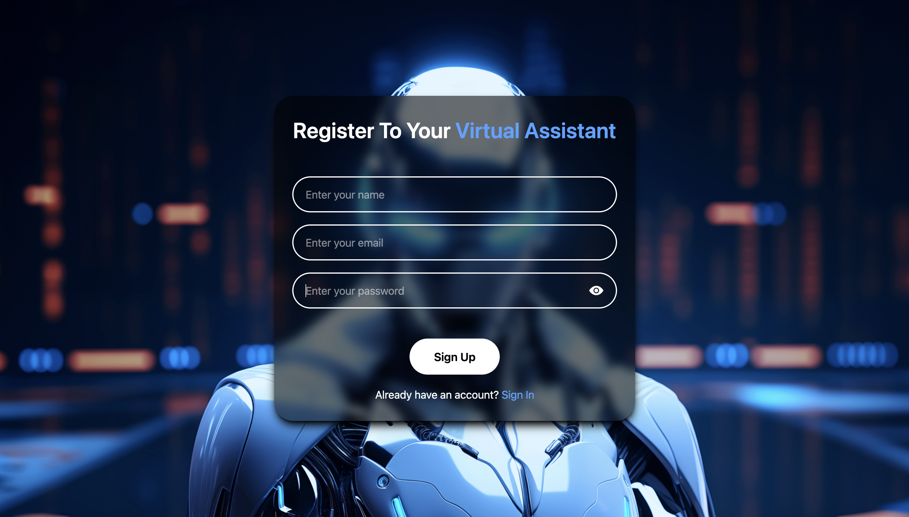
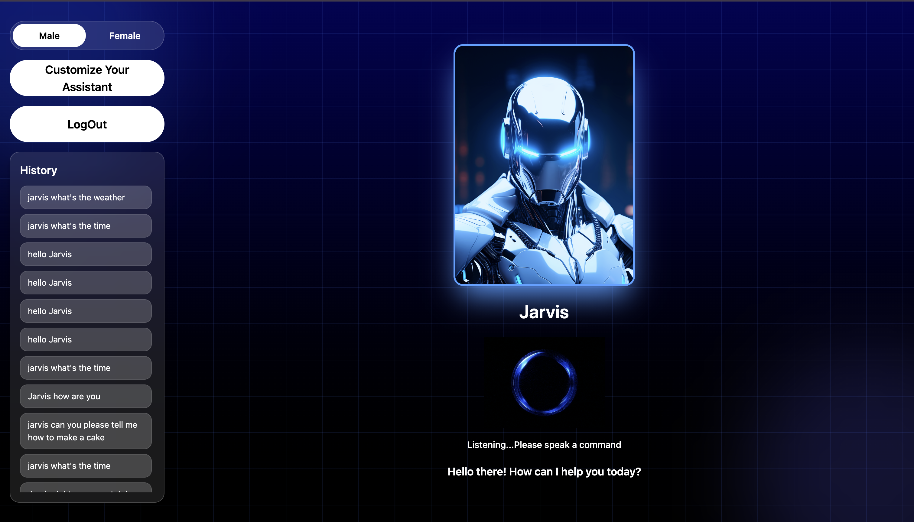
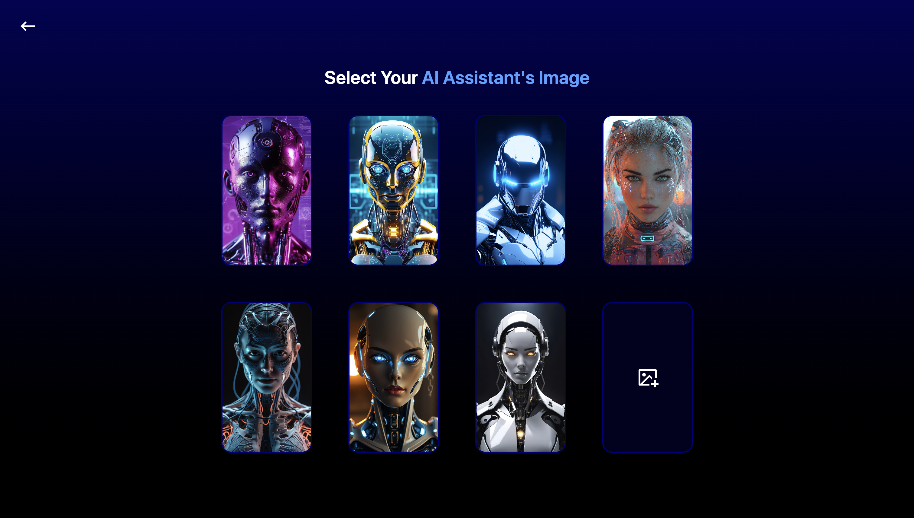

# AI Virtual Assistant

## About the Creator

Hi, I'm Jinay Shah, a 2nd year engineering student. This project is my first attempt at building a complete full stack application using the MERN stack, and I built it to learn how authentication, AI APIs, and voice based interfaces actually work together in a real product instead of just reading about them.

## About the Project

This is a voice enabled AI virtual assistant that lets users talk to a personalized assistant right from the browser. Each user can sign up, create an account, and customize their own assistant with a name and an image of their choice. Once set up, the assistant listens for its name and responds to voice commands using speech recognition and speech synthesis, with Google's Gemini API handling the natural language understanding behind the scenes.

The backend handles authentication, user data, and assistant customization, while the frontend manages voice recognition, text to speech, and the overall user interface. Common commands like checking the time, date, or day are handled locally for speed, and anything more open ended is passed to Gemini for a response.

## Deployment Link

[Add your live deployment link here]

## Preview

A quick look at the assistant in action.

## Features

- Secure sign up and login with hashed passwords and JWT based authentication
- Personalized assistant with a custom name and a custom image, stored and updated through Cloudinary
- Voice activated commands using the browser's Speech Recognition API
- Text to speech replies using the Speech Synthesis API, with a choice between a male and a female voice
- AI powered responses through the Gemini API for general questions and natural conversation
- Built in quick commands for things like time, date, day, month, opening Google, YouTube, Instagram, Facebook, and a calculator
- YouTube and Google search support directly through voice commands
- A history panel that keeps track of past commands for each user, viewable from the sidebar and the mobile menu
- A visual indicator that shows when the assistant is listening
- Fully responsive layout that works across desktop and mobile screen sizes

## How to Use

1. Open the deployed link or run the project locally
2. Sign up with your name, email, and password
3. Customize your assistant by giving it a name and choosing or uploading an image
4. Allow microphone access when prompted by the browser
5. Say your assistant's name followed by a command, for example "Jarvis what is the time" or "Jarvis search cats on YouTube"
6. Wait for the assistant to respond, both through voice and on screen text
7. Use the buttons on the top right (or the hamburger menu on mobile) to switch the assistant's voice, customize the assistant further, view your command history, or log out

## Note

This project works best on the Chrome browser, since the Speech Recognition API used here is most reliably supported there. Other browsers may not support voice input correctly.

This project uses the free tier of the Gemini API, so responses may occasionally be slow or limited depending on usage. This is a constraint of the free API plan and not a bug in the application itself.

## Connect with Me

LinkedIn: www.linkedin.com/in/jinayshah2005

Email: jinayshah1405@gmail.com

GitHub: https://github.com/JinayShah10
